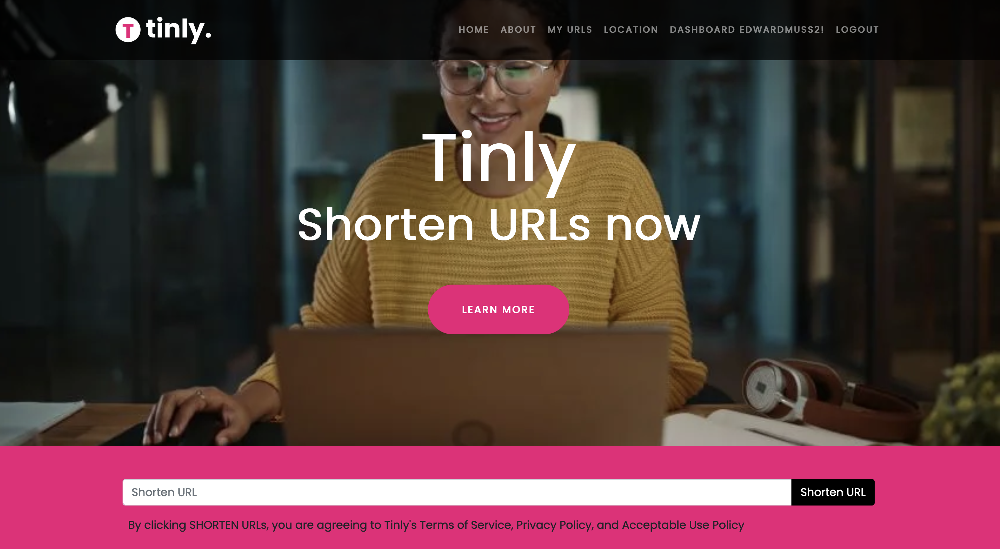
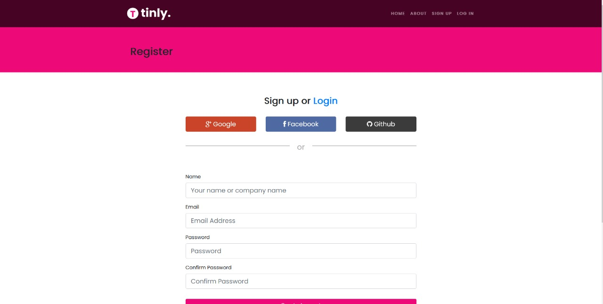
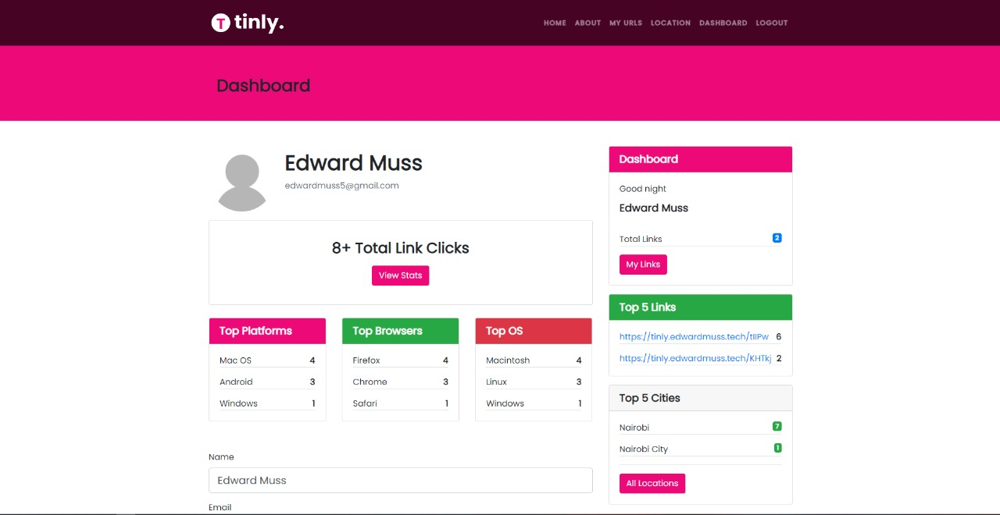
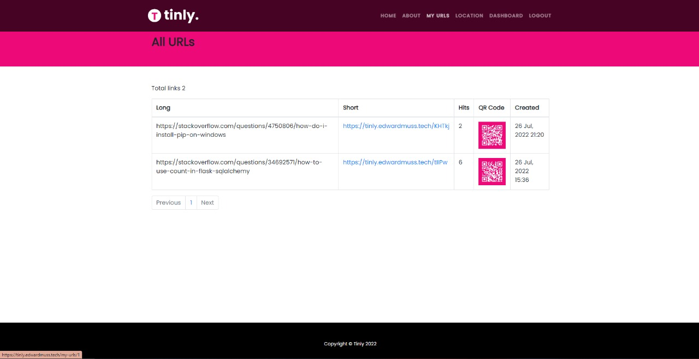

# Tinly
Tinly is a project that resembles Bitly or Cutly. The project concetrates on how to create a service like
[bitly.com](https://bitly.com)

## Instalation

### Clone the project

```
git clone https://github.com/edwardmuss/bitly_clone_flask.git
```

### cd into the project

```
cd bitly_clone_flask
```

### Activate Virtual Environment
```
source venv/bin/activate
```
if you choose to create a new enviroment(sometimes you have to delete the existing venv using `rm -r venv` and create a new one), remember to activate your newly created virtual environment

### Install required libraries

```
pip install -r requirements.txt
```

### Run App

```
flask run
```
or
```
python3 app.py
```






